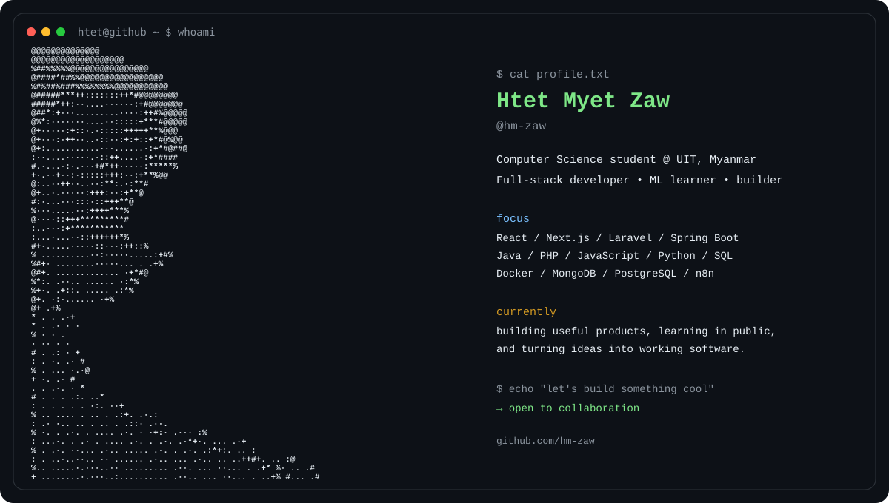

<div align="center">



</div>

<h2 align="center">Hey, I'm HTET MYET ZAW👋</h2>

<p align="center">
  Computer Science student at the <b>University of Information Technology (UIT), Myanmar</b><br/>
  building full-stack applications, exploring machine learning, and learning by shipping.
</p>

<p align="center">
  <a href="https://hmzaw-portfolio.vercel.app/">Portfolio</a> •
  <a href="https://www.linkedin.com/in/htetmyetzaw-uit/">LinkedIn</a> •
  <a href="https://www.facebook.com/share/1MNh7oQW3Y/?mibextid=wwXIfr">Facebook</a>
</p>

---

### `>_ about me`

```text
I'm a 5th-Year CS student who enjoys turning ideas into real, usable software.

→ Full-stack development
→ Backend & REST API design
→ React / Next.js interfaces
→ Java / Spring Boot & PHP / Laravel
→ Machine learning with Python & scikit-learn
→ Automation with n8n
→ Always learning something new
```

### `>_ tech stack`

**Languages**


**Frameworks & libraries**


**Tools & data**


---

### `>_ currently learning`

```text
[■■■■■■■■■■■■■■■■□□] Full-stack architecture
[■■■■■■■■■■■■■□□□□□] Machine learning
[■■■■■■■■■■■■□□□□□□] System design
[■■■■■■■■■■■■■■□□□□] Japanese / JLPT N2
[■■■■■■■■■■■■■■■□□□] Building better developer tools
```

---

### `>_ github`

<p align="center">
  
  
</p>

<p align="center">
  
</p>

---

### `>_ a little more`

```text
💡 I like building things that solve actual problems.
🧩 I enjoy both frontend interfaces and backend logic.
🤝 I like working in teams and learning from other developers.
🌱 Currently turning "I should build this" into "I shipped this."
```

<p align="center">
  <i>Thanks for stopping by — let's build something cool.</i> 🚀
</p>
